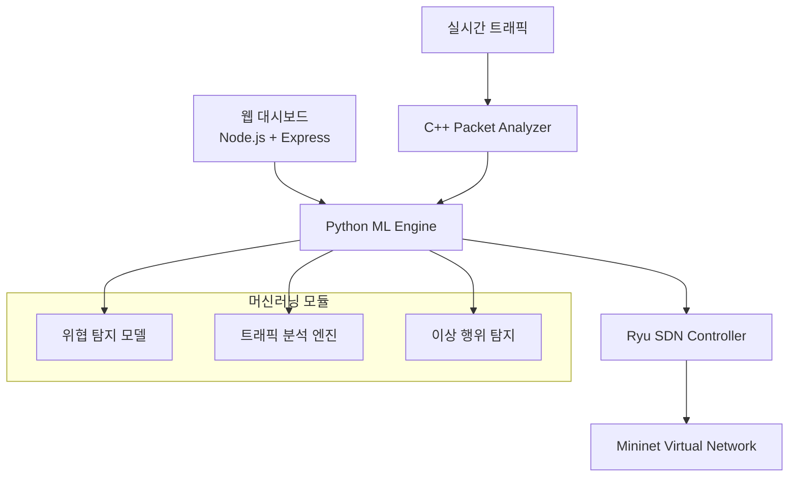

# ML-based SDN Attack Defense System in SDN

[](https://www.python.org/)
[](https://nodejs.org/)
[](https://isocpp.org/)
[](LICENSE)

> **머신러닝 기반의 SDN 네트워크 공격 방어 시스템**  
> Software Defined Networking 환경에서 실시간 위협 탐지 및 자동화된 보안 대응을 제공하는 시스템 개발

## 목차

- [프로젝트 개요](#-프로젝트-개요)
- [시스템 아키텍처](#️-시스템-아키텍처)
- [핵심 기능](#-핵심-기능)
- [기술 스택](#-기술-스택)

## 프로젝트 개요

소프트웨어 정의 네트워크(SDN: Software Defined Networking) 환경에서 발생할 수 있는 다양한 보안 위협에 대응하기 위한 머신러닝 기반의 자동화된 공격 탐지 및 방어 시스템을 설계하고 구현 및 최적화함을 목표로 한다. 머신러닝 알고리즘을 활용하여 SDN 네트워크에서 발생하는 다양한 공격을 실시간으로 탐지하고 자동으로 대응하는 지능형 보안 시스템을 구현한다.

### 해결하고자 하는 문제

- **DDoS 공격**: 대용량 트래픽을 통한 서비스 거부 공격
- **Flow Table Overflow**: 플로우 테이블 포화 공격
- **Controller Hijacking**: 컨트롤러 탈취 시도
- **Topology Poisoning**: 네트워크 토폴로지 조작
- **Man-in-the-Middle**: 중간자 공격

## 시스템 아키텍처



## 핵심 기능

### 지능형 위협 탐지
- **실시간 ML 기반 공격 탐지**: Random Forest, SVM, Neural Network 앙상블 모델
- **이상 탐지**: LSTM 기반 시계열 분석으로 비정상 트래픽 패턴 식별
- **적응형 학습**: 새로운 공격 패턴에 대한 온라인 학습

### 자동화된 방어 시스템
- **Dynamic Flow Rule Management**: 공격 트래픽 자동 차단
- **Traffic Shaping**: QoS 기반 트래픽 제어
- **Topology Reconfiguration**: 공격 경로 우회를 위한 동적 라우팅

### 실시간 모니터링 & 시각화
- **실시간 대시보드**: 네트워크 상태 및 위협 현황 모니터링
- **3D 네트워크 토폴로지**: 인터랙티브 네트워크 구조 시각화
- **공격-방어 시나리오**: 실시간 공격 탐지 및 대응 과정 애니메이션

## 기술 스택

###� Python (ML Engine & SDN Controller)
```python
# 주요 라이브러리
- TensorFlow / PyTorch  # 딥러닝 모델
- Scikit-learn          # 전통적 ML 알고리즘  
- Ryu Framework         # SDN 컨트롤러
- Mininet              # 네트워크 가상화
- Pandas, NumPy        # 데이터 처리
- Scapy               # 패킷 분석
```

### Node.js (Web Dashboard)
```javascript
// 주요 기술 스택
- Express.js          // 웹 서버
- Socket.io          // 실시간 통신
- D3.js             // 데이터 시각화
- Three.js          // 3D 네트워크 토폴로지
- Chart.js          // 차트 및 그래프
- Bootstrap        // UI 프레임워크
```

### C++ (High-Performance Packet Processing)
```cpp
// 핵심 모듈
- libpcap           // 패킷 캡처
- Boost Libraries   // 네트워크 프로그래밍
- OpenMP           // 병렬 처리
- Protocol Buffers // 데이터 직렬화
- dpdk            // 고속 패킷 처리 (옵션)
```

