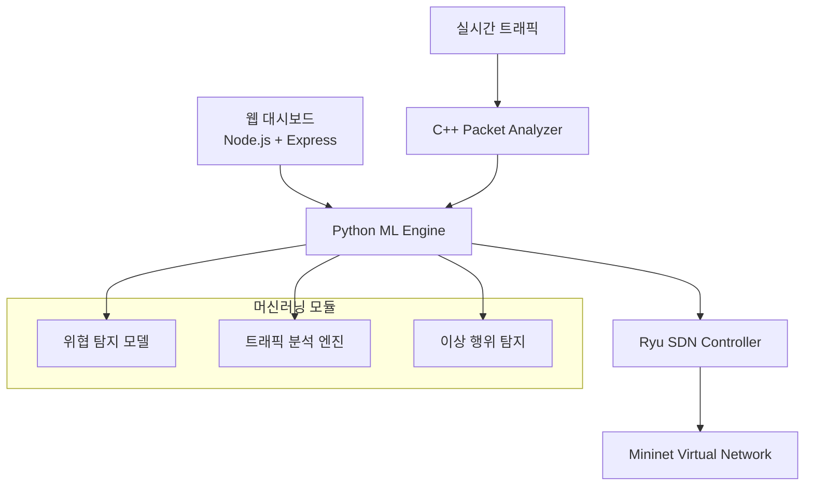

# 🛡️ ML-based SDN Attack Defense System in SDN

[](https://www.python.org/)
[](https://nodejs.org/)
[](https://isocpp.org/)
[](LICENSE)

> **머신러닝 기반의 SDN 네트워크 공격 방어 시스템**  
> Software Defined Networking 환경에서 실시간 위협 탐지 및 자동화된 보안 대응을 제공하는 시스템 개발

## 📋 목차

- [프로젝트 개요](#-프로젝트-개요)
- [시스템 아키텍처](#️-시스템-아키텍처)
- [핵심 기능](#-핵심-기능)
- [기술 스택](#-기술-스택)
- [설치 및 실행](#-설치-및-실행)
- [사용법](#-사용법)
- [시연 영상](#-시연-영상)
- [프로젝트 구조](#-프로젝트-구조)
- [API 문서](#-api-문서)
- [기여하기](#-기여하기)
- [라이센스](#-라이센스)

## 🎯 프로젝트 개요

소프트웨어 정의 네트워크(SDN: Software Defined Networking) 환경에서 발생할 수 있는 다양한 보안 위협에 대응하기 위한 머신러닝 기반의 자동화된 공격 탐지 및 방어 시스템을 설계하고 구현 및 최적화함을 목표로 한다. 머신러닝 알고리즘을 활용하여 SDN 네트워크에서 발생하는 다양한 공격을 실시간으로 탐지하고 자동으로 대응하는 지능형 보안 시스템을 구현한다.

### 🔍 해결하고자 하는 문제

- **DDoS 공격**: 대용량 트래픽을 통한 서비스 거부 공격
- **Flow Table Overflow**: 플로우 테이블 포화 공격
- **Controller Hijacking**: 컨트롤러 탈취 시도
- **Topology Poisoning**: 네트워크 토폴로지 조작
- **Man-in-the-Middle**: 중간자 공격

## 🏗️ 시스템 아키텍처



## ⭐ 핵심 기능

### 🤖 지능형 위협 탐지
- **실시간 ML 기반 공격 탐지**: Random Forest, SVM, Neural Network 앙상블 모델
- **이상 탐지**: LSTM 기반 시계열 분석으로 비정상 트래픽 패턴 식별
- **적응형 학습**: 새로운 공격 패턴에 대한 온라인 학습

### 🛡️ 자동화된 방어 시스템
- **Dynamic Flow Rule Management**: 공격 트래픽 자동 차단
- **Traffic Shaping**: QoS 기반 트래픽 제어
- **Topology Reconfiguration**: 공격 경로 우회를 위한 동적 라우팅

### 📊 실시간 모니터링 & 시각화
- **실시간 대시보드**: 네트워크 상태 및 위협 현황 모니터링
- **3D 네트워크 토폴로지**: 인터랙티브 네트워크 구조 시각화
- **공격-방어 시나리오**: 실시간 공격 탐지 및 대응 과정 애니메이션

## 🛠 기술 스택

### 🐍 Python (ML Engine & SDN Controller)
```python
# 주요 라이브러리
- TensorFlow / PyTorch  # 딥러닝 모델
- Scikit-learn          # 전통적 ML 알고리즘  
- Ryu Framework         # SDN 컨트롤러
- Mininet              # 네트워크 가상화
- Pandas, NumPy        # 데이터 처리
- Scapy               # 패킷 분석
```

### 🌐 Node.js (Web Dashboard)
```javascript
// 주요 기술 스택
- Express.js          // 웹 서버
- Socket.io          // 실시간 통신
- D3.js             // 데이터 시각화
- Three.js          // 3D 네트워크 토폴로지
- Chart.js          // 차트 및 그래프
- Bootstrap        // UI 프레임워크
```

### ⚡ C++ (High-Performance Packet Processing)
```cpp
// 핵심 모듈
- libpcap           // 패킷 캡처
- Boost Libraries   // 네트워크 프로그래밍
- OpenMP           // 병렬 처리
- Protocol Buffers // 데이터 직렬화
- dpdk            // 고속 패킷 처리 (옵션)
```

## 🚀 설치 및 실행

### 📋 시스템 요구사항
- Ubuntu 20.04+ / CentOS 8+
- Python 3.8+
- Node.js 16+
- GCC 9+ (C++17 지원)
- 최소 8GB RAM, 20GB 디스크 공간

### 1️⃣ 저장소 클론
```bash
git clone https://github.com/yourusername/sdn-ml-security.git
cd sdn-ml-security
```

### 2️⃣ Python 환경 설정
```bash
cd ml-engine
python -m venv venv
source venv/bin/activate  # Windows: venv\Scripts\activate
pip install -r requirements.txt

# Mininet 설치 (Ubuntu)
sudo apt-get install mininet

# Ryu 설치
pip install ryu
```

### 3️⃣ Node.js 웹 서버 설정
```bash
cd ../web-dashboard
npm install
```

### 4️⃣ C++ 패킷 분석기 빌드
```bash
cd ../packet-analyzer
mkdir build && cd build
cmake ..
make -j$(nproc)
```

### 5️⃣ 시스템 실행
```bash
# 터미널 1: C++ 패킷 분석기
cd packet-analyzer/build
sudo ./packet_analyzer

# 터미널 2: Python ML 엔진 & SDN 컨트롤러
cd ml-engine
python main.py

# 터미널 3: 웹 대시보드
cd web-dashboard
npm start
```

## 🎮 사용법

### 📊 웹 대시보드 접속
```
http://localhost:3000
```

### 🧪 가상 네트워크 시나리오 실행
```bash
# Mininet 토폴로지 생성
cd ml-engine/scenarios
sudo python ddos_scenario.py

# 공격 시뮬레이션
python attack_simulator.py --attack-type ddos --duration 60
```

### 📈 실시간 모니터링
- **네트워크 토폴로지**: 3D 인터랙티브 뷰로 네트워크 구조 확인
- **트래픽 분석**: 실시간 패킷 플로우 및 대역폭 사용량
- **위협 대시보드**: 탐지된 공격과 대응 조치 현황
- **ML 모델 성능**: 탐지 정확도 및 모델 신뢰도 지표

## 🎬 시연 영상

### 📹 DDoS 공격 탐지 및 방어
[](https://www.youtube.com/watch?v=DEMO_VIDEO_ID)

### 📹 Flow Table Overflow 방어
[](https://www.youtube.com/watch?v=DEMO_VIDEO_ID2)

## 📁 프로젝트 구조

```
sdn-ml-security/
├── 📂 ml-engine/                  # Python ML 엔진 & SDN 컨트롤러
│   ├── 📂 models/                # 머신러닝 모델
│   │   ├── threat_detector.py    # 위협 탐지 모델
│   │   ├── anomaly_detector.py   # 이상 탐지 모델
│   │   └── ensemble_model.py     # 앙상블 모델
│   ├── 📂 sdn_controller/        # Ryu SDN 컨트롤러
│   │   ├── defense_controller.py # 방어 컨트롤러
│   │   └── flow_manager.py       # 플로우 규칙 관리
│   ├── 📂 scenarios/             # 공격 시나리오
│   └── 📂 utils/                 # 유틸리티 함수
├── 📂 web-dashboard/             # Node.js 웹 대시보드
│   ├── 📂 public/               # 정적 파일
│   ├── 📂 src/                  # 소스 코드
│   │   ├── 📂 components/       # React 컴포넌트
│   │   ├── 📂 services/         # API 서비스
│   │   └── 📂 utils/           # 유틸리티
│   └── 📂 views/               # HTML 템플릿
├── 📂 packet-analyzer/          # C++ 패킷 분석기
│   ├── 📂 src/                 # C++ 소스 코드
│   │   ├── packet_capture.cpp   # 패킷 캡처
│   │   ├── traffic_analyzer.cpp # 트래픽 분석
│   │   └── feature_extractor.cpp # 특성 추출
│   ├── 📂 include/             # 헤더 파일
│   └── CMakeLists.txt          # CMake 설정
├── 📂 docs/                    # 문서
├── 📂 tests/                   # 테스트 코드
└── 📄 docker-compose.yml       # Docker 컨테이너 설정
```

## 📚 API 문서

### 🔌 실시간 WebSocket API
```javascript
// 위협 탐지 이벤트 구독
socket.on('threat_detected', (data) => {
    console.log('위협 탐지:', data);
    // data: { type, severity, source_ip, timestamp, confidence }
});

// 네트워크 상태 구독  
socket.on('network_status', (data) => {
    console.log('네트워크 상태:', data);
    // data: { topology, traffic, flow_rules }
});
```

### 🌐 REST API 엔드포인트
```http
GET    /api/network/topology        # 네트워크 토폴로지 조회
GET    /api/threats/history         # 위협 탐지 이력
POST   /api/defense/block-ip        # IP 차단
GET    /api/models/performance      # ML 모델 성능 지표
POST   /api/scenarios/simulate      # 공격 시나리오 시뮬레이션
```

## 📊 성능 지표

### 🎯 ML 모델 성능
| 공격 유형 | 정확도 | 정밀도 | 재현율 | F1-Score |
|-----------|--------|--------|--------|----------|
| DDoS      | 98.5%  | 97.2%  | 99.1%  | 98.1%    |
| Flow Overflow | 96.8% | 95.5% | 98.0% | 96.7%  |
| Topology Poison | 94.2% | 93.1% | 95.5% | 94.3% |

### ⚡ 시스템 성능
- **패킷 처리 속도**: 100,000 pps (C++ 분석기)
- **탐지 지연시간**: < 50ms (평균)
- **방어 응답시간**: < 200ms (평균)
- **메모리 사용량**: < 2GB (전체 시스템)

## 🤝 기여하기

프로젝트 개선에 참여해주세요! 

### 🔧 개발 환경 설정
1. Fork 및 Clone
2. 새 브랜치 생성: `git checkout -b feature/amazing-feature`
3. 변경사항 커밋: `git commit -m 'Add amazing feature'`
4. 브랜치에 Push: `git push origin feature/amazing-feature`
5. Pull Request 생성

### 📝 코딩 컨벤션
- **Python**: PEP 8 준수, Black 포매터 사용
- **JavaScript**: ESLint + Prettier 설정
- **C++**: Google C++ Style Guide 준수

## 👥 팀 정보

| 역할 | 이름 | 담당 업무 |
|------|------|-----------|
| 팀장 | 김OO | 전체 아키텍처 설계, Python ML 엔진 |
| 개발자 | 이OO | Node.js 웹 대시보드, 시각화 |
| 개발자 | 박OO | C++ 패킷 분석기, 성능 최적화 |
| 개발자 | 최OO | SDN 컨트롤러, 네트워크 보안 |

## 📄 라이센스

이 프로젝트는 MIT 라이센스 하에 배포됩니다. 자세한 내용은 [LICENSE](LICENSE) 파일을 참조하세요.

## 📞 문의

프로젝트에 대한 질문이나 제안사항이 있으시면 언제든 연락해주세요!

- 📧 Email: your.email@university.edu
- 🐙 GitHub: [프로젝트 저장소](https://github.com/yourusername/sdn-ml-security)
- 📚 Wiki: [프로젝트 위키](https://github.com/yourusername/sdn-ml-security/wiki)

---

<div align="center">

**🛡️ Making SDN Networks Safer with AI 🛡️**

[](https://github.com/yourusername/sdn-ml-security)
[](https://github.com/yourusername/sdn-ml-security/fork)

</div>
